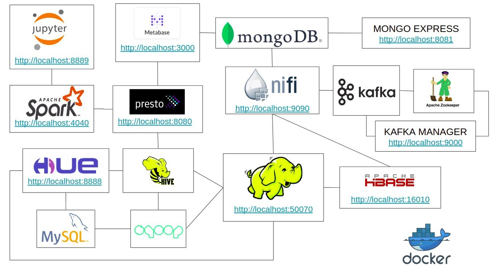

# BIG DATA ECOSYSTEM COM DOCKER

Ambiente para estudo dos principais frameworks big data em docker.
  HDFS, HBase, Hive, Presto, Spark, Jupyter, Hue, Mongodb, Metabase, Nifi, kafka, Hue, Mysql e Zookeeper.
   

## COMO FAZER

1. - Baixar o repo
    
          git clone https://github.com/fabiogjardim/bigdata_docker.git

2. - Instalar o Docker
  
   1. - No Windows ou Mac:
   
   
   2. - No Ubuntu:
   
      
   Verificar a instação:
   
        docker version
        docker-compose version
 
3. - No diretorio bigdata_docker, executar o docker-compose
   
          docker-compose up -d
        
4. - Verificando imagens e containers
 
         docker image ls
         docker container ls
       
5. - Acessando WebUI dos Frameworks
 
      HDFS *http://localhost:50070*
      
      Presto *http://localhost:8080*
    
      Hbase *http://localhost:16010/master-status*
    
      Mongo Express *http://localhost:8081*
    
      Kafka Manager *http://localhost:9000*
    
      Metabase *http://localhost:3000*
    
      Nifi *http://localhost:9090*
      
      Jupyter Spark *http://localhost:8889*
    
      Hue *http://localhost:8888*

6. - Acessando o HDFS

          docker exec -it datanode bash

7. - Acessando HBase

          docker exec -it hbase-master bash

8. - Acessando Sqoop

          docker exec -it datanode bash
        
9. - Acessando Kafka

          docker exec -it kafka bash

10. - JDBC MySQL

          jdbc:mysql://database/employees

11. - JDBC Hive

          jdbc:hive2://hive-server:10000/default

12. - JDBC Preto

          jdbc:presto://presto:8080/hive/default
      

[Docker Hub](https://hub.docker.com/u/fjardim)
